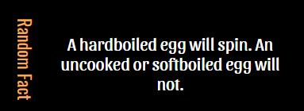
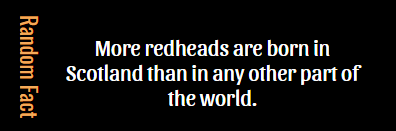

# MMM-rfacts
Random Facts for MagicMirror2

  

# Just install it.....

    ~/MagicMirror/modules
    git clone https://github.com/cowboysdude/MMM-rfact
    cd MagicMirror/modules/MMM-rfacts
    npm install
    
#  Add to config.js

           {
	        disabled: false,
            module: 'MMM-rfacts',
            position: 'top_left' 
           },
           
  NO kidding, just that simple!!!

# There are translation files for
      German
	  Swedish
	  Danish
	  Chinese
	  Spanish
	  French
	  Korean
	  and others!  
 
